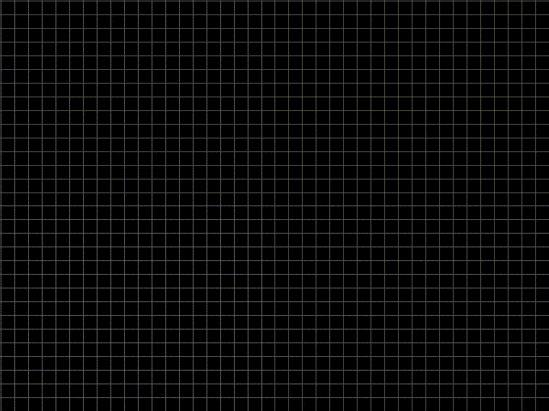

# complex-grapher

Creates animations of complex functions

This is an "archive" of a small project I made in November 2018, before I learned how to use git/GitHub. The first "real" commit presents the source as close to untouched as possible, with personal information and Eclipse bloat removed.

I was able to build/run this project with vscode + OpenJDK 11, but I cannot promise that you will have an easy time. Note that I may make improvements to this repository at any time, hence the quotes surrounding "archive."

## Demo

The gif below shows this program graphing the hyperbolic tangent function `tanh`

